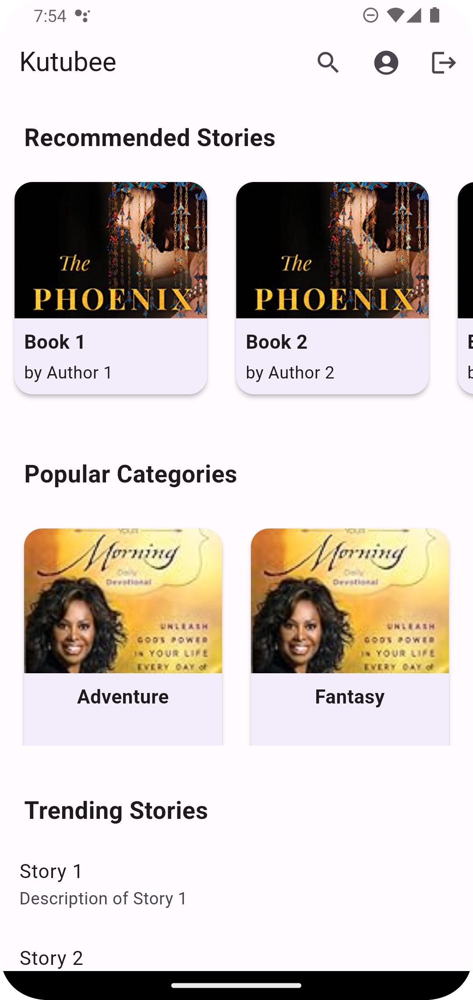

# MyBooks Library Booking App Development Guide

## Screenshots

 
 

## Overview
This guide outlines the steps to create a book library booking app using Flutter. The app allows users to browse books, book them, and manage their bookings.

## Features
1. **User Authentication**
    - Register and log in.
    - Authentication using email/password or social media.

2. **Browse Books**
    - List available books.
    - Categories, filters, and search.

3. **Book Details**
    - Show book information and availability status.

4. **Booking Functionality**
    - Book specific books with a pickup date.
    - Manage booking history.

5. **User Profile**
    - View and edit profile.
    - View booking history and current bookings.

6. **Admin Panel**
    - Manage books, users, and bookings.

## Tech Stack
- Flutter
- Firebase (Authentication, Firestore)
- Provider/Bloc
- Dart

## Development Steps
1. **Setup Flutter Project**
    - Install Flutter SDK.
    - Create a new project.

2. **Design UI**
    - Design UI screens for various functionalities.

3. **Implement Authentication**
    - Integrate Firebase Authentication.

4. **Set Up Firestore Database**
    - Create Firestore collections.
    - Define database schema and rules.

5. **Develop App Logic**
    - Implement functionality using Flutter and Firebase.

6. **Integrate Firebase Services**
    - Utilize Firestore for storing data.

7. **Testing & Debugging**
    - Test the app thoroughly.
    - Debug any issues.

8. **Deployment**
    - Deploy to Google Play Store and Apple App Store.

9. **Maintenance & Updates**
    - Regularly update the app based on feedback.

## Resources
- [Flutter Documentation](https://flutter.dev/docs)
- [Firebase Documentation](https://firebase.google.com/docs)
- [Flutter Packages](https://pub.dev/)

# دليل تطوير تطبيق MyBooks لحجز مكتبة الكتب

## نظرة عامة
هذا الدليل يوضح الخطوات لإنشاء تطبيق MyBooks لحجز الكتب في المكتبة باستخدام فلاتر. يتيح التطبيق للمستخدمين تصفح الكتب وحجزها وإدارة حجوزاتهم.

## الميزات
1. **المصادقة للمستخدمين**
    - التسجيل وتسجيل الدخول.
    - المصادقة باستخدام البريد الإلكتروني/كلمة المرور أو وسائل التواصل الاجتماعي.

2. **تصفح الكتب**
    - قائمة الكتب المتاحة.
    - الفئات والفلاتر والبحث.

3. **تفاصيل الكتاب**
    - عرض معلومات الكتاب وحالة التوفر.

4. **وظيفة الحجز**
    - حجز الكتب مع تحديد تاريخ الاستلام.
    - إدارة تاريخ الحجز.

5. **الملف الشخصي للمستخدم**
    - عرض وتحرير الملف الشخصي.
    - عرض تاريخ الحجز والحجوزات الحالية.

6. **لوحة الإدارة**
    - إدارة الكتب والمستخدمين والحجوزات.

## التكنولوجيا المستخدمة
- فلاتر (Flutter)
- فايربيس (Firebase) (المصادقة، Firestore)
- مزود/بلوك (Provider/Bloc)
- دارت (Dart)

## الخطوات في التطوير
1. **إعداد مشروع فلاتر**
    - تثبيت SDK فلاتر.
    - إنشاء مشروع جديد.

2. **تصميم واجهة المستخدم**
    - تصميم شاشات الواجهة لمختلف الوظائف.

3. **تنفيذ المصادقة**
    - دمج مصادقة فايربيس.

4. **إعداد قاعدة بيانات Firestore**
    - إنشاء مجموعات Firestore.
    - تحديد هيكل البيانات والقواعد.

5. **تطوير منطق التطبيق**
    - تنفيذ الوظائف باستخدام فلاتر وفايربيس.

6. **دمج خدمات فايربيس**
    - استخدام Firestore لتخزين البيانات.

7. **الاختبار وإصلاح الأخطاء**
    - اختبار التطبيق بشكل شامل.
    - إصلاح أي مشاكل.

8. **النشر**
    - نشر التطبيق على متجر جوجل بلاي ومتجر تطبيقات آبل.

9. **الصيانة والتحديثات**
    - تحديث التطبيق بانتظام استنادًا إلى الملاحظات.

## الموارد
- [وثائق فلاتر](https://flutter.dev/docs)
- [وثائق فايربيس](https://firebase.google.com/docs)
- [حزم فلاتر](https://pub.dev/)

